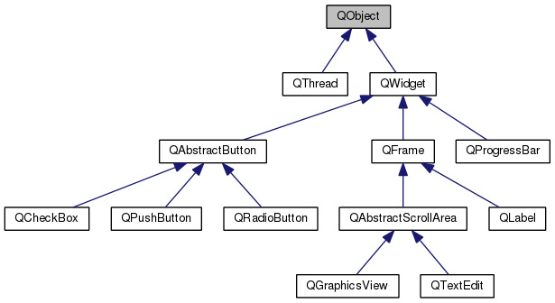

# [Qt_Tutorial_Official](https://wiki.qt.io/Qt_for_Beginners)

## .pro file

* a file to discribe what the QT project is ahout
* used to identify a QT project

### Basic .pro file
```cpp
TEMPLATE = app
TARGET = name_of_the_app

QT = core gui

greaterThan(QT_MAJOR_VERSION, 4): QT += widgets
```
+ **TEMPLATE** the type to build. etc application
+ **TARGET** the name of the app or the library
+ **QT** which library to use

### Sources and Headers

* shold be added automatically

## QApplication

* the library take care of mant things especially ***event loop***

### Event Loop

* waiting ofr events, like mouse clicks on a GUI

## How Program is Compiled

**Three Steps**

- the .pro file to describe the project to compile
- the makefile generated by qmake or cmake
- the prgram is built using make

## A Pretty Button

**QT objects have a lot of attributes that can be modified using getters and setters.**
**In QT, if an attribute is called *foo*, the associated getter and setter will have these signatures**

```cpp
T foo() const;
void setFoo(const T);
```

**Qt extends this system of attributes and getters and setters to *propertty*.**
**A property is a value of any type that can be accessed, be modified or constant, and can notify a change.**
* text
* font
* tooltip
* icon
* etc.

### QPushButton QFont QIcon

**Functions**

```cpp
setText();
setToolTip();
setFont();
setIcon();
show();

//set an icon from an icon theme on Linux
QIcon::fromTheme();
```

## Qt Class Hierarchy


### QObject

**Basic Capabilities**

* **object name**

* **parenting system**

* **signal and slots**

* **event management**

**QWidget** contains most properties like position and size, mouse cursor, tooltips, etc.

**Remark**: In Qt, a widget can also be a window. **There is no need for a "***QWindow***" class.**

**QAbstractButton** provides basic properties that are shared by all buttons.

## Parenting System

- When an object is destroyed, ***all of its children*** are destroyed as well.

- All QObjects have *findChild* and *findChildren* methods that can be used to search for children of a given object.

- Child widgets in a **QWidget** automatically appear **inside** the parent widget.

```cpp
// creates a QPushButton inside a QPushButton
#include <QApplication>
#include <QPushButton>

int main(int argc, char **argv)
{
 QApplication app (argc, argv);

 QPushButton button1 ("test");
 QPushButton button2 ("other", &button1);

 button1.show();

 return app.exec();
}
```

Put a button inside a widget
Three are two methods.
```cpp
void QWidget::setFixedSize(int width, int height);
void QWidget::setGeometry(int x, int y, int width, int height);
```

## Subclassing QWidget

**New Elements**

- The **Q_OBJECT** macro

- **signals** (a category of methods)

- **public slots** (A category of methods)

*Implementing the window is donw in the constuctor*
- size of the window
- the widgets that this window contains and their positions

## The Observer Pattern

used when an *observable* object wants to notify other *observer* object about a state change.

- A user has clicked on a button, and a menu should be displayed.

- A web page just finished loading, and a process should extract some information from this loaded page

- A user is scrolling through a list of items (in an app store for example), and has reached the end, so more items should be loaded.

## Signals and slots

- **signal**: a message that an object can send, usually to report a status change.

- **slot**: a function that accepts and responds to a signal.

**Example**

- clicked

- pressed

- released

**Some slots**

- QApplication::quit

- QWidget::setEnabled

- QPushButton::setText

A slot must be connected to a signal in order to respond to a signal.
Qt provides the method **QObject::connect** used with two macros

**SIGNAL**
and 
**SLOT**

**Example**
```cpp
FooObjectA *fooA = new FooObjectA();
FooObjectB *fooB = new FooObjectB();

QObject::connect(fooA, SIGNAL (bared()), fooB, SLOT (baz()));
```

**Remark**: Signals and Slots are methods, that might or might not have arguments, but that never return anything.

## Transmitting information

**Example**

- signal
```cpp
void MediaProgressManager::tick(int miliseconds);
```

- slot
```cpp
void QProgressBar::setValue(int value);
```

The signal and the slot have the same kind of parameters, especially the **type**
Because the signal transmits the information to the slot using the parameters.
The first parameter of the signal is passed to the first one of the slot, and the same for second, third, and so forth.

The code for the connection will look like this:
```cpp
MediaProgressManager *manager = new MediaProgressManager();
QProgressBar *progress = new QProgressBar(window);

QObject::connect(manager, SIGNAL (tick(int)), progress, SLOT (setValue(int)));
```

Inside the SIGNAL and SLOT macro:
provide the type of the values that are passed through the signals.
can also provide the name of the variable(even better).

## Examples

### Responding to an event

Gain access to the QApplication instance while you are in another class

```cpp
QApplication * QApplication::instance()
```

The example is written in the [HelloWorld](HelloWorld/).

## Transmitting Information with Signals and Slots

**Example**

Display a progress bar and a slider inside a window and while the slider is moved, the value of the progress bar is synced 

**Signals and Slots**:

```cpp
void QSlider::valueChanged(int value);
void QProgressBar::setValue(int value);
```

main.cpp
```cpp
#include <QApplication>
#include <QProgressBar>
#include <QSlider>

int main(int argc, char **argv)
{
 QApplication app (argc, argv);

 // Create a container window
 QWidget window;
 window.setFixedSize(200, 80);

 // Create a progress bar
 // with the range between 0 and 100, and a starting value of 0
 QProgressBar *progressBar = new QProgressBar(&window);
 progressBar->setRange(0, 100);
 progressBar->setValue(0);
 progressBar->setGeometry(10, 10, 180, 30);

 // Create a horizontal slider
 // with the range between 0 and 100, and a starting value of 0
 QSlider *slider = new QSlider(&window);
 slider->setOrientation(Qt::Horizontal);
 slider->setRange(0, 100);
 slider->setValue(0);
 slider->setGeometry(10, 40, 180, 30);

 window.show();

 // Connection
 // This connection set the value of the progress bar
 // while the slider's value changes
 QObject::connect(slider, SIGNAL (valueChanged(int)), progressBar, SLOT (setValue(int)));

 return app.exec();
}
```
## The Meta object

**Meta-object** (literally "over the object") is a way to achieve some programming paradigms that are normally impossible to achieve with pure C++ like: 

- **Introspection**: capability of examining a type at run-time

- **Asynchronous function calls**`
Subclass [QObject](https://doc.qt.io/qt-6/qobject.html#) and mark it so that the meta-object compiler(moc) can interpret and translate it in order to use such meta-object capabilities in an application.


All the information about methodss that are used to retrieve meta-information 

```cpp
const QMetaObject * QObject::metaObject () const
```

[QMetaObject](https://doc.qt.io/qt-6/qmetaobject.html#) class contains all the methods that deal with meta-objects.

## Important Macros

**Q_OBJECT**

The moc is provided to translate the QT syntax like "connect", "signals", "slots", etc into regular C++ syntax.
This is done by specifying the Q_OBJECT macro in the header containing class definitions that use suck syntax.

*mywidget.h*
```cpp
class MyWidget : public QWidget
{
 Q_OBJECT
 public:
  MyWidget(QWidget *parent = 0);
}
```

Other marker macros

- **signals**

- public/protected/private **slots**

When a signal is emitted, the meta-object system is used to compare the signature of the signal, to check the connection, and to find the slot using it's signature.
These macros are actually used to convert the provided method signature into a string that matches the one stored in the meta-object.

## Creating Custom Signals and Slots

Slots are like normal methods, but with **small decorations around**
Signals need **little to no implementation** at all.
